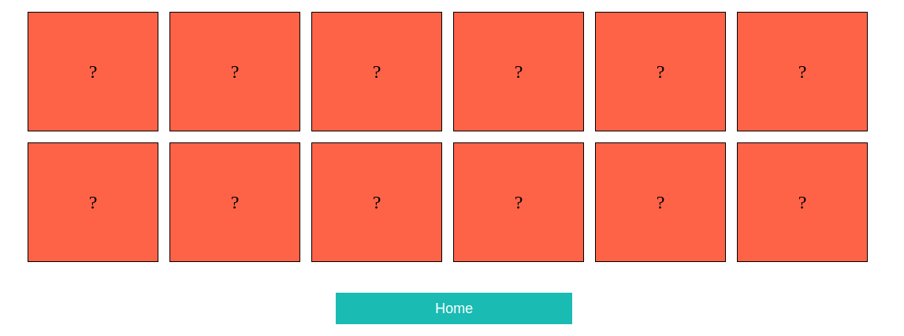

# Memory Game

## Reasons for Creating this Project

I created this memory game project because I wanted to become more comfortable with a couple of things:

1. Doing card flip animations with CSS.
1. Implementing an image upload functionality in a ReactJS application from scratch.

After completing this project, I definitely feel more comfortable with the above processes.

## How to Play

In this project there are two modes the user can play in. In "Play Now" a default deck of twelve cards of numbers will be displayed for the user to play.

Otherwise, if the user would like to customize the number of cards, and/or the cards values, they can do so in "Custom Play" mode. In _Custom Play_ mode the user can create cards with text or or image values.

In this game all of the cards are flipped over so that the player cannot see what text or image is on each card. The goal is to flip two cards with the same value.

After doing this, those two cards will disappear. If the cards are not the same value (as pictured below), the cards will be flipped back to being face down and the player will have to try again. The player's goal is to match all of the cards.

For a more elaborate description on how to play this memory game, view the [Concentration Card Game Wikipedia page](<https://en.wikipedia.org/wiki/Concentration_(card_game)>).
